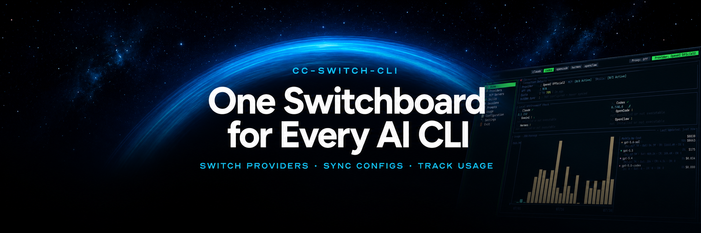
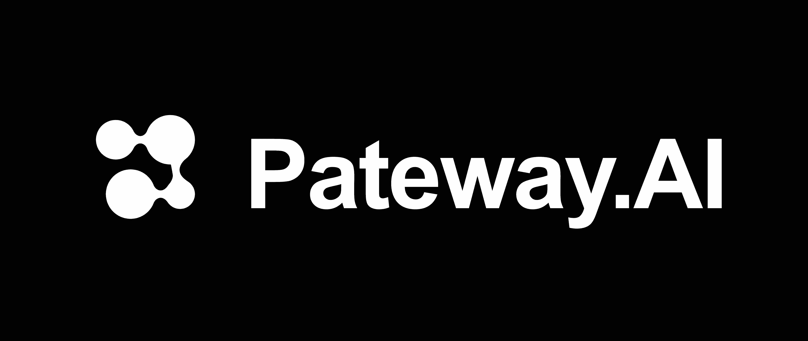
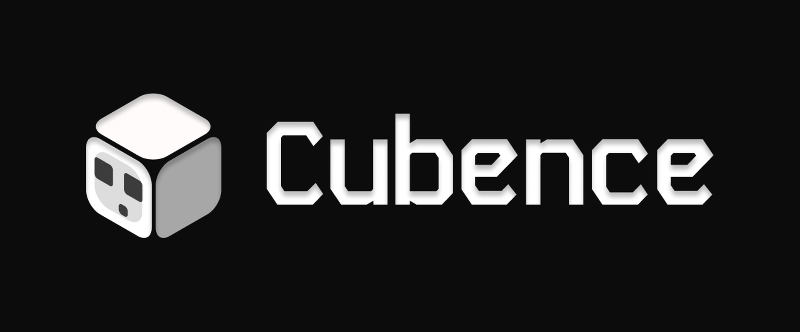
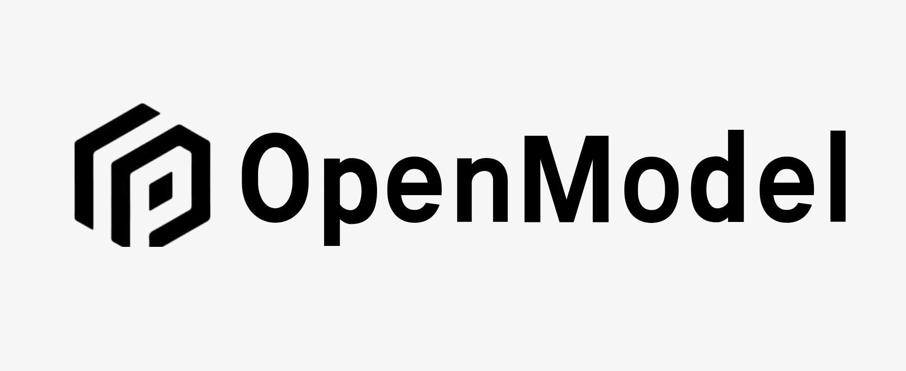
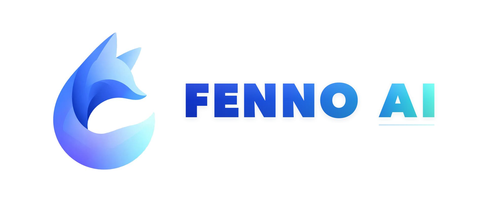
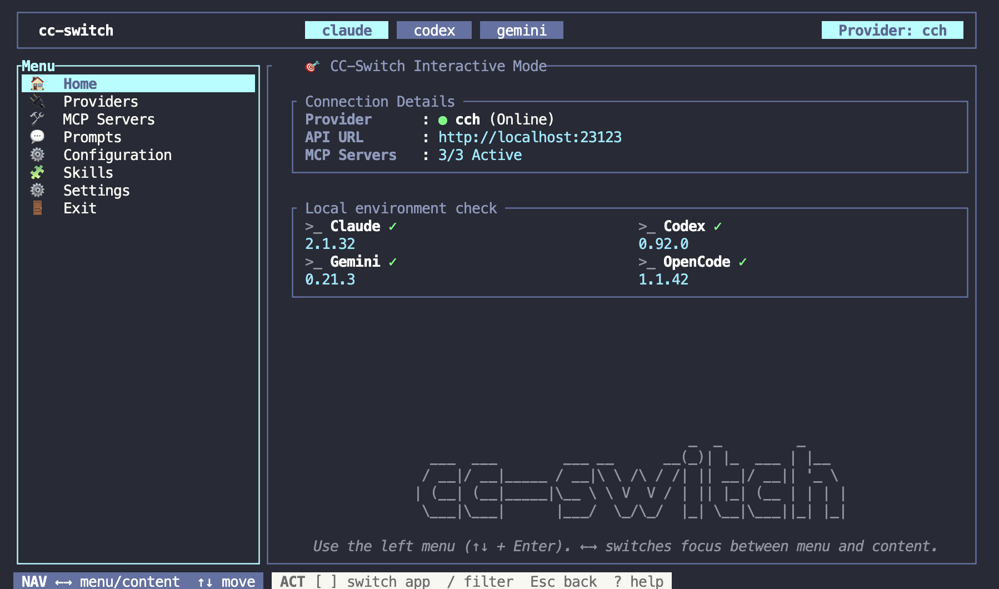

<div align="center">

## CC-Switch CLI

**対話型 TUI またはスクリプトで利用できる CLI から、Claude Code、Codex、Gemini、OpenCode、Hermes、OpenClaw、Pi を一元管理できます。**

[](https://github.com/saladday/cc-switch-cli/releases)
[](https://github.com/saladday/cc-switch-cli/releases)
[](https://www.rust-lang.org/)
[](LICENSE)

<a href="https://trendshift.io/repositories/22544" target="_blank"></a>

[English](README.md) | [中文](README_ZH.md) | 日本語

</div>

---

## 📖 このプロジェクトについて

このプロジェクトは [CC-Switch](https://github.com/farion1231/cc-switch) の **CLI フォーク**です。

🔄 WebDAV 同期機能は、上流プロジェクトと完全に互換性があります。

**変更履歴：** [CHANGELOG.md](CHANGELOG.md)

---

## ❤️ スポンサー

[](https://www.aicodemirror.ai/register?invitecode=77V9EA)

本プロジェクトをご支援いただいている **AICodeMirror** に感謝します！AICodeMirror は、Claude、Codex、Gemini の公式チャネルを利用した安定性の高い API 中継サービスを提供しています。企業向けの高い同時処理能力、迅速な請求書発行、24 時間・年中無休の専任技術サポートに対応しています。Codex の公式チャネルは **通常料金の 7% から**利用でき、チャージ時には追加割引もあります。

CC-Switch CLI ユーザー向けの特典として、[こちらのリンク](https://www.aicodemirror.ai/register?invitecode=77V9EA)から登録すると、**初回チャージが 20% オフ**になります。

---

<table>
  <tr>
    <td width="180">
      <a href="https://console.apito.ai/agent/register/Bsi9NDlWGpkPoAii">
        
      </a>
    </td>
    <td>
      本プロジェクトをご支援いただいている <b>ClaudeAPI</b> に感謝します！<b>ClaudeAPI</b> は、公式チャネルと AWS チャネルを利用する Claude 向け API 接続サービスです。高い安定性と低遅延を実現し、Claude Code、Codex、エージェントのワークフロー、企業での利用に幅広く対応しています。法人導入、チームの利用管理、請求書発行にも対応しています。CC-Switch CLI ユーザー向けの特典として、<a href="https://console.apito.ai/agent/register/Bsi9NDlWGpkPoAii">専用リンク</a>から登録すると無料の試用クレジットを受け取り、すぐに Claude Code を使い始められます。
    </td>
  </tr>
  <tr>
    <td width="180">
      <a href="https://pateway.ai/?ch=18fxbjo">
        
      </a>
    </td>
    <td>
      PatewayAI は、経験豊富な AI 開発者向けの API 中継サービスです。Claude と Codex のモデル群に幅広く対応しています。すべてのモデルは高品質な公式チャネルから提供され、出力品質の低下やモデルの偽装はありません。料金の内訳も明確で、利用履歴を確認できます。<br/>
      公式料金から最大 95% オフで利用できます。<a href="https://pateway.ai/?ch=18fxbjo">こちらのリンク</a>から登録すると試用クレジットを受け取れるほか、不定期のキャンペーンでも無料クレジットを獲得できます。<br/>
      企業向けの同時処理能力、専用管理画面、正式な契約書と請求書の発行にも対応しています。紹介する側とされる側の双方に、最大 150 ドルの紹介特典があります。
    </td>
  </tr>
  <tr>
    <td width="180">
      <a href="https://cubence.com/signup?code=SC3M1CAH&source=ccscli">
        
      </a>
    </td>
    <td>
      本プロジェクトをご支援いただいている <b>Cubence</b> に感謝します！Cubence は、安定性と効率性を重視した API 中継サービスです。2025 年 9 月から運営されており、Claude Code、Codex、Gemini などに対応しています。<a href="https://cubence.com/signup?code=SC3M1CAH&source=ccscli">こちらのリンク</a>から登録し、チャージ時にクーポンコード <code>CCSCLI</code> を入力すると、10% オフになります。
    </td>
  </tr>
  <tr>
    <td width="180">
      <a href="https://www.openmodel.ai/?ref=JGDNqZl8">
        
      </a>
    </td>
    <td>
      1 つの API で、主要モデルをまとめて利用！<a href="https://www.openmodel.ai/?ref=JGDNqZl8"><b>OpenModel</b></a> は、本番運用向けの高可用性 AI API ゲートウェイです。自動フェイルオーバー、最適なチャネルへのインテリジェントなルーティング、本番運用向け SLA により、アプリケーションの速度と安定性を支えます。単一プロバイダーを大きく上回る SLA で、安定性を競争力に変えます。Claude Code、Codex、Gemini CLI にそのまま接続できます。<a href="https://www.openmodel.ai/?ref=JGDNqZl8">こちらのリンク</a>から登録してご利用ください。
    </td>
  </tr>
  <tr>
    <td width="180">
      <a href="https://s.qiniu.com/FVfiEb">
        
      </a>
    </td>
    <td>
      本プロジェクトをご支援いただいている <b>Qiniu Cloud AI</b> に感謝します！<b>Qiniu Cloud（香港証券取引所：02567）</b>が提供する企業向け大規模モデル MaaS プラットフォームです。世界の主要モデル 150 種類以上を一括で利用でき、主要なモデルプロバイダーのプロトコルに対応しています。テキスト、画像、音声、動画、ファイル処理を含むマルチモーダル機能を提供し、<b>169 万以上</b>の企業・開発者ユーザーに利用されています。<br/>
      特典として、法人ユーザーは <b>1,200 万トークンを無料</b>で受け取れます。友人紹介では最大で<b>数百億トークン</b>を獲得できます。<a href="https://s.qiniu.com/FVfiEb">こちらのリンク</a>から登録してください。
    </td>
  </tr>
  <tr>
    <td width="180">
      <a href="https://api.fenno.ai/register?redirect=/purchase?tab=subscription%26group=16&aff=Z6XB52KCVP6Y">
        
      </a>
    </td>
    <td>
      本プロジェクトをご支援いただいている <b>Fenno.ai</b> に感謝します！Fenno.ai は、現在 Codex を中心に提供している、安定性と効率性に優れた API 中継サービスです。OpenAI と Anthropic の両プロトコルに対応し、Codex、Claude Code、OpenCode などの主要な開発ツールとスムーズに連携できます。1 日あたり数千億トークン規模の企業利用を安定して処理し、中国国内外の法人間決済と請求書発行に対応しています。<br/>
      CC-Switch CLI ユーザー向けの特典として、<a href="https://api.fenno.ai/register?redirect=/purchase?tab=subscription%26group=16&aff=Z6XB52KCVP6Y">こちらのリンク</a>から、<b>9.9 人民元で 150 米ドル分のクレジット</b>を利用できる Coding Plan に申し込めます。友人紹介では最大 <b>20% の報酬</b>を受け取れます。紹介するほど特典が増えます！
    </td>
  </tr>
  <tr>
    <td width="180">
      <a href="https://www.packyapi.com/register?aff=cc-switch-cli">
        
      </a>
    </td>
    <td>
      本プロジェクトをご支援いただいている <b>PackyCode</b> に感謝します！PackyCode は、Claude Code、Codex、Gemini などに対応する、信頼性と効率性に優れた API 中継サービスです。<br/>
      CC-Switch CLI ユーザー向けの割引として、<a href="https://www.packyapi.com/register?aff=cc-switch-cli">こちらのリンク</a>から登録し、チャージ時にクーポンコード <code>cc-switch-cli</code> を入力すると、<b>10% オフ</b>になります。
    </td>
  </tr>
  <tr>
    <td width="180">
      <a href="https://ddshub.short.gy/ccscli">
        
      </a>
    </td>
    <td>
      本プロジェクトをご支援いただいている <b>DDS</b> に感謝します！DDS Hub は、信頼性と性能に優れた Claude API プロキシサービスです。中国国内の個人・法人ユーザー向けに、費用対効果の高い Claude への直接接続・高速化サービスを提供しています。安定した低遅延の Claude Max アカウントプールを備え、<b>Claude Haiku、Opus、Sonnet</b> などの主要モデルに対応しています。1,000 人民元以上のチャージで請求書を発行できます。法人のお客様には、専用のグループ設定と技術サポートも提供しています。<br/>
      CC-Switch CLI ユーザー向けの特典として、<a href="https://ddshub.short.gy/ccscli">こちらのリンク</a>から登録すると、初回チャージ時に<b>追加で 10% 分のクレジット</b>を受け取れます（チャージ後、グループ管理者にお問い合わせください）。
    </td>
  </tr>
</table>

---

## 📸 スクリーンショット

<div align="center">
  <h3>ホーム</h3>
  
</div>

<br/>

<table>
  <tr>
    <th>切り替え</th>
    <th>設定</th>
  </tr>
  <tr>
    <td></td>
    <td></td>
  </tr>
</table>

## 🚀 クイックスタート

**TUI モード（推奨）**

```bash
cc-switch
```

全画面のインターフェースで、プロバイダーの切り替え、アカウント管理、セッションの確認、プロキシの状態確認を行えます。

**コマンドラインモード**

```bash
cc-switch provider list              # プロバイダーを一覧表示
cc-switch provider switch <id>       # プロバイダーを切り替え
cc-switch use <id>                   # プロバイダーを切り替え（ショートカット）
cc-switch provider export <id>       # Claude プロバイダーを単独の設定ファイルにエクスポート
cc-switch provider stream-check <id> # プロバイダーのストリームの正常性を確認
cc-switch start claude <id>          # グローバル設定を切り替えずに、このプロバイダーで Claude を起動
cc-switch start codex <id>           # グローバル設定を切り替えずに、このプロバイダーで Codex を起動
cc-switch start codex <id> --shared-sessions # プロバイダー間で永続的な Codex 履歴を共有
cc-switch start claude <id> --dry-run # Claude を起動せずに起動内容をプレビュー
cc-switch auth list                  # 管理中の ChatGPT/Codex OAuth アカウントを一覧表示
cc-switch sessions list --all        # 保存済みのアシスタントセッションを確認
cc-switch sessions sync-usage --all  # ローカルセッションのトークン使用量・コストを取り込み
cc-switch config webdav show         # WebDAV 同期設定を確認
cc-switch env tools                  # ローカルの CLI ツールを確認
cc-switch mcp sync                   # MCP サーバーを同期
cc-switch proxy show                 # プロキシのルートと状態を確認

# グローバルの `--app` フラグで対象アプリを指定：
cc-switch --app claude provider list    # Claude のプロバイダーを管理
cc-switch --app codex mcp sync          # Codex の MCP サーバーを同期
cc-switch --app gemini prompts list     # Gemini のプロンプトを一覧表示
cc-switch --app hermes provider list    # Hermes のプロバイダーを管理
cc-switch --app openclaw provider list  # OpenClaw のプロバイダーを管理
cc-switch --app pi provider list        # Pi のプロバイダーを管理

# 対応アプリ：`claude`（デフォルト）、`codex`、`gemini`、`opencode`、`hermes`、`openclaw`、`pi`
```

複数のターミナルで異なるプロバイダーを使いたい場合は、`cc-switch start` を使用します。このコマンドが影響するのは、そのコマンドで起動した Claude または Codex のセッションだけです。`provider switch` と `use` は引き続きグローバルのプロバイダーを変更します。TUI では、Providers ページでプロバイダーを選択し、`o` を押すと同じ動作になります。

macOS/Linux では、`start codex` に `--shared-sessions` を追加すると、設定された Codex ホームのセッション、アーカイブ済みセッション、SQLite 履歴インデックスを共有できます。各プロバイダーは、そのホームの `.cc-switch-launches/` 配下にある専用の永続ディレクトリを使用します。Codex はこれらのディレクトリを経由するセッションパスを記録するため、ディレクトリは削除せずに残してください。異なるプロバイダーは同時に実行できますが、同じプロバイダーの共有起動は、先に起動したプロセスの実行中には拒否されます。Codex のスレッドごとの書き込みロックも共有されるため、別のプロバイダーから再開する前に、実行中のセッションを閉じてください。ログイン情報の変更はそのプロバイダーに保存されますが、起動時のみの設定は保存済みのプロバイダー設定に含まれません。ネイティブの `--model`、`resume`、`fork` 引数に対応しています。共有モードでは `--config`、`--profile`、`--oss` による上書きは利用できません。

共有起動では、グローバルの履歴設定を変更せずに、既存の統一された `custom` プロバイダー識別子を使用します。過去の公式プロバイダーのセッションも含めるには、既存の **Unified Codex session history** 設定と任意の移行機能を使用してください。プロバイダーをまたいで会話を継続できるかどうかは、暗号化された推論を含む過去の会話内容を接続先が受け付けるかどうかに依存します。デフォルトの一時起動と TUI の `o` ショートカットの動作は変わりません。

コマンドの一覧は「機能」セクションをご覧ください。

---

## 📥 インストール

### 方法 1：クイックインストール（macOS / Linux）

> Windows ユーザーは、以下の「手動インストール」をご覧ください。

```bash
curl -fsSL https://github.com/SaladDay/cc-switch-cli/releases/latest/download/install.sh | bash
```

`cc-switch` は `~/.local/bin` にインストールされます。インストール先を変更するには、`CC_SWITCH_INSTALL_DIR` を設定してください。

- インストール先にファイルが存在する場合、TTY では確認を求めます。非対話型シェルでは、`CC_SWITCH_FORCE=1` が設定されていない限り上書きしません。
- Linux の自動モードは静的リンクされた musl ビルドを使用し、glibc にはフォールバックしません。互換性のある glibc ビルドが明示的に必要な場合のみ、`CC_SWITCH_LINUX_LIBC=glibc` を設定してください。

<details>
<summary>手動インストール</summary>

#### macOS

```bash
# Universal Binary をダウンロード（推奨、Apple Silicon と Intel に対応）
curl -LO https://github.com/saladday/cc-switch-cli/releases/latest/download/cc-switch-cli-darwin-universal.tar.gz

# 展開
tar -xzf cc-switch-cli-darwin-universal.tar.gz

# 実行権限を付与
chmod +x cc-switch

# PATH に含まれるディレクトリへ移動
sudo mv cc-switch /usr/local/bin/

# 「開発元を検証できません」という警告が表示される場合
xattr -cr /usr/local/bin/cc-switch
```

#### Linux（x64）

```bash
# ダウンロード
curl -LO https://github.com/saladday/cc-switch-cli/releases/latest/download/cc-switch-cli-linux-x64-musl.tar.gz

# 展開
tar -xzf cc-switch-cli-linux-x64-musl.tar.gz

# 実行権限を付与
chmod +x cc-switch

# PATH に含まれるディレクトリへ移動
sudo mv cc-switch /usr/local/bin/
```

#### Linux（ARM64）

```bash
# Raspberry Pi または ARM サーバー向け
curl -LO https://github.com/saladday/cc-switch-cli/releases/latest/download/cc-switch-cli-linux-arm64-musl.tar.gz
tar -xzf cc-switch-cli-linux-arm64-musl.tar.gz
chmod +x cc-switch
sudo mv cc-switch /usr/local/bin/
```

#### Windows

```powershell
# ZIP ファイルをダウンロード
# https://github.com/saladday/cc-switch-cli/releases/latest/download/cc-switch-cli-windows-x64.zip

# 展開後、cc-switch.exe を PATH に含まれるディレクトリへ移動（例）：
move cc-switch.exe C:\Windows\System32\

# または直接実行
.\cc-switch.exe
```

</details>

### 方法 2：Homebrew でインストール

Homebrew を使用している場合は、次のコマンドで cc-switch をインストールできます。

```bash
brew install cc-switch-cli
```

更新：

```bash
brew upgrade cc-switch-cli
```

Homebrew でインストールした場合は、更新も Homebrew で行ってください。組み込みの更新機能を使うと、Homebrew の Formula が管理する更新処理に支障が出ます。

### 方法 3：ソースからビルド

**前提条件：**

- Rust 1.85 以降（[rustup でインストール](https://rustup.rs/)）

**ビルド：**

```bash
git clone https://github.com/saladday/cc-switch-cli.git
cd cc-switch-cli/src-tauri
cargo build --release

# バイナリの場所：./target/release/cc-switch
```

**システムにインストール：**

```bash
# macOS/Linux
sudo cp target/release/cc-switch /usr/local/bin/

# Windows
copy target\release\cc-switch.exe C:\Windows\System32\
```

---

## ✨ 機能

### 🔌 プロバイダー管理

**Claude Code**、**Codex**、**Gemini**、**OpenCode**、**Hermes**、**OpenClaw**、**Pi** の API 設定を管理します。

Pi のプロバイダー管理は、Pi 本来の追加型の構成モデルに従い、`models.json.providers` の登録内容を基準にします。CC-Switch は、Pi のログイン認証情報やグローバルのデフォルトプロバイダー・モデルを変更しません。
Pi の TUI は、他のアプリと同じテーブル、フォーム、ショートカットの操作体系を採用し、Presets、System Prompts、Prompt Templates をそれぞれ独立したページとして提供します。

**主な機能：** ワンクリックでの切り替え、Claude の設定を単独ファイルにエクスポート、複数エンドポイントへの対応、API キー管理、リモートのモデル検出、対応アプリでの速度テストやストリームの正常性確認など。

```bash
cc-switch provider list              # すべてのプロバイダーを一覧表示
cc-switch provider current           # 現在のプロバイダーを表示
cc-switch provider switch <id>       # プロバイダーを切り替え
cc-switch use <id>                   # プロバイダーを切り替え（ショートカット）
cc-switch provider add               # プロバイダーを追加
cc-switch provider edit <id>         # 既存のプロバイダーを編集
cc-switch provider duplicate <id>    # プロバイダーを複製
cc-switch provider delete <id>       # プロバイダーを削除
cc-switch provider export <id>       # Claude が自動読み込みする ./.claude/settings.local.json にエクスポート
cc-switch provider speedtest <id>    # API のレイテンシを測定
cc-switch provider stream-check <id> # ストリームの正常性を確認
cc-switch provider fetch-models <id> # リモートのモデル一覧を取得
cc-switch provider export <id> --output ~/.claude/settings-demo.json # 設定ファイルの出力先を指定
```

### 🔐 アカウント管理

ChatGPT/Codex の OAuth アカウントをローカルで管理し、複数のプロバイダープロファイルで再利用できます。ローカルプロキシを通じて、Codex の OAuth アカウントを Claude Code のプロバイダーとして使うこともできます。

**主な機能：** デバイスフローによるログイン、アカウント一覧、デフォルトアカウントの選択、アカウント削除、長期有効なトークンを各プロバイダーにコピーせずに行えるアカウントの紐付け。

```bash
cc-switch auth status                # 管理中のアカウントの状態を表示
cc-switch auth login                 # ChatGPT/Codex OAuth でログイン
cc-switch auth list                  # ログイン済みアカウントを一覧表示
cc-switch auth default <account-id>  # デフォルトアカウントを設定
cc-switch auth remove <account-id>   # アカウントを削除
```

### 🛠️ MCP サーバー管理

Claude、Codex、Gemini、OpenCode、Hermes の Model Context Protocol サーバーをまとめて管理します。

**主な機能：** 一元管理、複数アプリへの対応、stdio/http/sse トランスポート、リモートサーバー認証用ヘッダー、自動同期、TOML/JSON 形式の実設定ファイルへの対応。

```bash
cc-switch mcp list                   # すべての MCP サーバーを一覧表示
cc-switch mcp add                    # MCP サーバーを追加（対話式）
cc-switch mcp edit <id>              # MCP サーバーを編集
cc-switch mcp delete <id>            # MCP サーバーを削除
cc-switch mcp enable <id> --app claude   # 指定したアプリで有効化
cc-switch mcp disable <id> --app claude  # 指定したアプリで無効化
cc-switch mcp validate <command>     # PATH 内のコマンドを検証
cc-switch mcp sync                   # 実設定ファイルに同期
cc-switch mcp import --app claude    # 実設定ファイルからインポート
```

### 💬 プロンプト管理

AI コーディングアシスタントのシステムプロンプトのプリセットを管理します。

**対応アプリ：** Claude（`CLAUDE.md`）、Codex（`AGENTS.md`）、Gemini（`GEMINI.md`）、OpenCode（`AGENTS.md`）、Hermes（`AGENTS.md`）、OpenClaw（`AGENTS.md`）、Pi（`AGENTS.md`、ネイティブのシステムプロンプト、プロンプトテンプレート）。

```bash
cc-switch prompts list               # プロンプトのプリセットを一覧表示
cc-switch prompts current            # 現在有効なプロンプトを表示
cc-switch prompts activate <id>      # プロンプトを有効化
cc-switch prompts deactivate         # 現在有効なプロンプトを無効化
cc-switch prompts create [name]      # プリセットを作成（名前は任意で指定可能）
cc-switch prompts rename <id> [name] # プリセットの名前を変更（名前省略時は対話式）
cc-switch prompts edit <id>          # プリセットを編集
cc-switch prompts show <id>          # 内容を全文表示
cc-switch prompts delete <id>        # プロンプトを削除
cc-switch --app pi prompts system edit append # APPEND_SYSTEM.md を編集
cc-switch --app pi prompts templates list     # Pi のプロンプトテンプレートを一覧表示
```

### 🎯 スキル管理

コミュニティのスキルで、Claude Code/Codex/Gemini/OpenCode/Hermes/Pi の機能を管理・拡張します。

**主な機能：** 単一の管理元（SSOT）を持つスキルストア、アプリごとの有効化・無効化、アプリのディレクトリへの同期、手動での更新確認と更新、未管理スキルの検出・インポート、リポジトリ内のスキル検索、skills.sh マーケットプレイス検索。

```bash
cc-switch skills list                # インストール済みスキルを一覧表示
cc-switch skills discover <query>      # 利用可能なスキルを検索（別名：search）
cc-switch skills market <query>      # skills.sh マーケットプレイスを検索
cc-switch skills install <name>      # スキルをインストール
cc-switch skills check-updates       # 更新の有無を手動で確認
cc-switch skills update <name>       # リポジトリ由来のスキルを 1 件更新
cc-switch skills update --all        # 検出された更新をすべて適用
cc-switch skills uninstall <name>    # スキルをアンインストール
cc-switch skills enable <name>       # 現在のアプリ（--app）で有効化
cc-switch skills disable <name>      # 現在のアプリ（--app）で無効化
cc-switch skills info <name>         # スキルの情報を表示
cc-switch skills sync                # 有効なスキルをアプリのディレクトリに同期
cc-switch skills sync-method [m]     # 同期方式を表示・設定（auto|symlink|copy）
cc-switch skills scan-unmanaged      # アプリのディレクトリにある未管理スキルを検出
cc-switch skills import-from-apps    # 未管理スキルを SSOT にインポート
cc-switch skills repos list          # スキルリポジトリを一覧表示
cc-switch skills repos add <repo>    # リポジトリを追加（owner/name[@branch] または GitHub URL）
cc-switch skills repos remove <repo> # リポジトリを削除（owner/name または GitHub URL）
cc-switch skills repos enable <repo> # ブランチを変えずにリポジトリを有効化
cc-switch skills repos disable <repo> # ブランチを変えずにリポジトリを無効化
```

### 📊 使用状況の概要

TUI のホーム画面では、アプリ別・モデル別の過去 30 日間の使用状況を画面サイズに合わせて表示します。トークン使用量とコストの内訳、プロキシの状態、バックグラウンドでの更新に対応しています。

### 🕘 セッション履歴と使用統計

保存済みのアシスタントセッションの確認、コマンド 1 つでの再開、古い記録の削除、ローカルのセッションログからトークン使用量・コスト統計への取り込みを行えます。

**主な機能：** 全履歴のページ送り表示、アプリ横断のスキャン、メッセージのプレビュー、再開コマンドのコピー、安全な削除、JSON 出力、表示中のページのトークン使用量・コスト詳細、Claude、Codex、Gemini、OpenCode、Pi の使用量同期。Hermes のコストは、情報を取得できる場合に表示されます。

```bash
cc-switch sessions list --all        # 対応アプリの保存済みセッションをまとめて一覧表示
cc-switch sessions show <id>         # セッションのメタデータとメッセージを表示
cc-switch sessions resume <id>       # 保存済みセッションを再開
cc-switch sessions delete <id>       # 保存済みセッションを削除
cc-switch sessions sync-usage --all  # ローカルログを使用統計に同期
```

### ⚙️ 設定管理

設定のバックアップ、インポート、エクスポートを管理します。

**主な機能：** バックアップ名の指定、対話式のバックアップ選択、自動ローテーション（10 件保持）、インポート・エクスポート、共通設定スニペット、WebDAV 同期。

```bash
cc-switch config show                # 設定を表示
cc-switch config path                # 設定ファイルのパスを表示
cc-switch config validate            # 設定ファイルを検証

# 共通スニペット（プロバイダー間で共有する設定）
# 適用可能な場合は実設定の更新を試みる（`--apply` は互換性のためだけに残されているフラグ）
cc-switch --app claude config common show
cc-switch --app claude config common set --snippet '{"env":{"CLAUDE_CODE_DISABLE_NONESSENTIAL_TRAFFIC":1},"includeCoAuthoredBy":false}'
cc-switch --app claude config common clear

# バックアップ
cc-switch config backup              # バックアップを作成（自動命名）
cc-switch config backup --name my-backup  # 名前を指定してバックアップを作成

# 復元
cc-switch config restore             # 対話式：バックアップ一覧から選択
cc-switch config restore --backup <id>    # ID を指定してバックアップから復元
cc-switch config restore --file <path>    # 外部ファイルから復元

# インポート・エクスポート
cc-switch config export <path>       # 外部ファイルにエクスポート
cc-switch config import <path>       # 外部ファイルからインポート

# WebDAV 同期
cc-switch config webdav show
cc-switch config webdav set --base-url <url> --username <user> --password <password> --enable
cc-switch config webdav jianguoyun --username <user> --password <password>
cc-switch config webdav check-connection
cc-switch config webdav upload
cc-switch config webdav download
cc-switch config webdav migrate-v1-to-v2

cc-switch config reset               # 設定を初期状態にリセット
```

### 🌉 プロキシ管理とモデル中継

対応アプリについて、デーモンが管理するアプリごとのプロキシルートを確認・制御します。

**主な機能：** アプリ単位での有効化・無効化、アプリごとの待受ポート、デーモンが管理するワーカー、現在のルート確認、ダッシュボードのテレメトリ、トークン使用量の集計、デバッグ用のフォアグラウンド実行モード。

ローカルプロキシは、Claude Code、Codex、Gemini の通信を CC-Switch 経由にできます。OpenAI Responses API と Chat Completions のプロバイダーに対応し、Codex から Anthropic Messages 互換のプロバイダーを使うこともできます。また、対応する構成では DeepSeek、Kimi、Qwen、OpenRouter、xAI、Groq、Mistral などの主要な OpenAI 互換モデルに接続できます。

```bash
cc-switch proxy show                              # プロキシ設定、ルート、デーモンのワーカー状態を表示
cc-switch proxy enable                            # Claude のプロキシルートを有効化（デフォルトのアプリ）
cc-switch --app codex proxy enable                # Codex のプロキシルートを有効化
cc-switch --app gemini proxy disable              # Gemini のプロキシルートを無効化
cc-switch --app claude proxy config --listen-port 15721
cc-switch --app codex proxy config --listen-port 15722
cc-switch proxy serve --takeover claude           # フォアグラウンドのデバッグモード（デーモン管理のルートが有効な間は実行不可）
```

通常の CLI/TUI からのプロキシの有効化・無効化は、デーモンを通じて実行されます。最初のアプリのプロキシルートを有効にするとデーモンが自動起動し、有効な対応アプリ（Claude、Codex、Gemini）ごとに 1 つのワーカーを実行します。有効なプロキシルートがなくなると、自動的に終了します。

> **対応プラットフォーム：** デーモン管理のプロキシは Unix ドメインソケットを使うスーパーバイザーに依存しており、**macOS と Linux でのみ利用可能**です。Windows では、`proxy enable` / `proxy disable` と `daemon` サブコマンドは利用できず、`managed sessions are only supported on unix` というエラーになります。Windows でローカルプロキシを動かすには、スーパーバイザーなしで中継を開始するフォアグラウンドモードを使用してください。
>
> ```bash
> cc-switch proxy serve --takeover claude
> ```
>
> `proxy show` と `proxy config` はすべてのプラットフォームで利用できます。[#294](https://github.com/SaladDay/cc-switch-cli/issues/294) もご覧ください。

### 🧪 環境とローカルツール

環境設定の競合や、必要なローカル CLI のインストール状況を確認します。

```bash
cc-switch env check                  # 環境設定の競合を確認
cc-switch env list                   # 関連する環境変数を一覧表示
cc-switch env tools                  # Claude/Codex/Gemini/OpenCode/Hermes/OpenClaw/Pi の CLI を確認
```

### 🌐 多言語対応

対話モードは英語と中国語に対応しており、言語設定は自動的に保存されます。

- デフォルトの言語：英語
- `⚙️ Settings` メニューから言語を変更できます

### 🔧 ユーティリティ

シェル補完、環境管理などのユーティリティを提供します。

```bash
# シェル補完
cc-switch completions install --activate   # 推奨：bash/zsh 向けにインストールして有効化
cc-switch completions install              # インストールのみ（rc ファイルは変更しない）
cc-switch completions status               # 管理中の補完設定の状態を確認
cc-switch completions uninstall            # 管理中の補完ファイルを削除
cc-switch completions bash                 # 互換性のための補完スクリプト直接生成
cc-switch completions fish                 # 管理対象外のシェルでも直接生成可能

# 環境管理
cc-switch env check                  # 環境設定の競合を確認
cc-switch env list                   # 環境変数を一覧表示

# 自己更新
cc-switch update                     # 最新リリースに更新
cc-switch update --version vX.Y.Z    # 指定したバージョンに更新
```

自動インストールと有効化は、現在 `bash` と `zsh` のみに対応しています。他のシェル向けには、`cc-switch completions fish` のように補完スクリプトを直接生成できます。

---

## 🏗️ アーキテクチャ

### 基本設計

- **SQLite による状態管理**：主要データはデフォルトで `~/.cc-switch/cc-switch.db` に保存されます（`CC_SWITCH_CONFIG_DIR` を設定した場合は `$CC_SWITCH_CONFIG_DIR/` 配下）。従来の `config.json` は、旧形式のインポートと移行のためにのみ保持されます
- **スキルの SSOT**：スキルのソースファイルはデフォルトで `~/.cc-switch/skills/` に保存されます（`CC_SWITCH_CONFIG_DIR` を設定した場合は `$CC_SWITCH_CONFIG_DIR/skills/`）。インストール状態とアプリごとの有効化状態はデータベースで管理します
- **安全な実設定ファイルへの同期（デフォルト）**：まだ初期化されていないアプリの実設定ファイルへの書き込みをスキップします（`~/.claude`、`~/.codex`、`~/.gemini`、`~/.config/opencode`、`~/.hermes`、`~/.openclaw` が意図せず作成されるのを防ぎます）
- **アトミックな書き込み**：一時ファイルを作成してから名前を変更する方式で、ファイルの破損を防ぎます
- **サービス層の再利用**：元の GUI 版のサービス層を 100% 再利用しています
- **安全な並行処理**：スコープ付きガードを伴う RwLock を使用します

### 設定ファイル

**CC-Switch の保存先**（デフォルト：`~/.cc-switch`、変更用環境変数：`CC_SWITCH_CONFIG_DIR`）：

- `~/.cc-switch/cc-switch.db` — プロバイダー、MCP、プロンプト、アプリの状態を保存するメインデータベース
- `~/.cc-switch/settings.json` — 設定
- `~/.cc-switch/skills/` — インストール済みスキルのソース（SSOT）
- `~/.cc-switch/backups/` — 自動ローテーションされるバックアップ（10 件保持）
- `~/.cc-switch/config.json` — 互換性とインポート処理のために保持される従来の JSON

`CC_SWITCH_CONFIG_DIR` を設定すると、そのディレクトリを設定のルートとして使用します。`~/.cc-switch` にある既存データは自動的には移行されません。

**各アプリの実設定ファイル：**

- Claude：`~/.claude/settings.json`（プロバイダー・共通設定）、`~/.claude.json`（MCP）、`~/.claude/CLAUDE.md`（プロンプト）
- Codex：`~/.codex/auth.json`（認証状態）、`~/.codex/config.toml`（プロバイダー・共通設定・MCP）、`~/.codex/AGENTS.md`（プロンプト）
  - Codex の設定ディレクトリは、CC-Switch で手動指定したパスを優先します。指定がなければ、Codex の `$CODEX_HOME` が既存のディレクトリを指している場合はその場所を使用し、それ以外は `$HOME/.codex` を使用します。
- Gemini：`~/.gemini/.env`（プロバイダーの環境変数）、`~/.gemini/settings.json`（設定・MCP）、`~/.gemini/GEMINI.md`（プロンプト）
- OpenCode：`~/.config/opencode/opencode.json`（プロバイダー・MCP・実行時設定）、`~/.config/opencode/AGENTS.md`（プロンプト）
- Hermes：`<Hermes home>/config.yaml`（プロバイダー・MCP・メモリ設定）、`AGENTS.md`（プロンプト）、`skills/`、`memories/`。ディレクトリは、CC-Switch 設定内の `hermesConfigDir`、空でない `HERMES_HOME`、プラットフォームのデフォルト（macOS/Linux では `~/.hermes`、Windows では `%LOCALAPPDATA%\hermes`）の順に優先します。Hermes と同じ `HERMES_HOME` をエクスポートした環境から CC-Switch を起動してください。
- OpenClaw：`~/.openclaw/openclaw.json`（プロバイダー・環境変数・ツール・エージェントのデフォルト設定）、`~/.openclaw/AGENTS.md`（プロンプト）
- Pi：`~/.pi/agent/models.json`（追加型のプロバイダー設定）、`~/.pi/agent/settings.json`（デフォルト設定とセッションの場所。読み取りのみ）、`~/.pi/agent/AGENTS.md`、`SYSTEM.md`、`APPEND_SYSTEM.md`、`prompts/`、`skills/`、`sessions/`

---

## ❓ よくある質問（FAQ）

<details>
<summary><b>プロバイダーを切り替えても設定が反映されないのはなぜですか？</b></summary>

<br>

まず、対象の CLI が少なくとも一度初期化されていること（設定ディレクトリが存在すること）を確認してください。未初期化のアプリでは、CC-Switch が実設定ファイルへの同期をスキップし、警告を表示する場合があります。対象 CLI を一度実行する（例：`claude --help`、`codex --help`、`gemini --help`、`opencode --help`、`openclaw --help`）か、Hermes の場合は `~/.hermes` を作成してから、もう一度切り替えてください。

この問題は、多くの場合 **環境変数の競合**が原因です。システムの環境変数に API キー（`ANTHROPIC_API_KEY`、`OPENAI_API_KEY` など）が設定されていると、CC-Switch の設定よりも優先されます。

**解決方法：**

1. 競合を確認します。

   ```bash
   cc-switch env check --app claude
   ```

2. 関連する環境変数をすべて表示します。

   ```bash
   cc-switch env list --app claude
   ```

3. 競合が見つかった場合は、手動で削除します。
   - **macOS/Linux**：シェルの設定ファイル（`~/.bashrc`、`~/.zshrc` など）を編集します。

     ```bash
     # 該当する環境変数の行を探して削除
     nano ~/.zshrc
     # vim、code など、好みのテキストエディターでも可
     ```

   - **Windows**：「システムのプロパティ」→「環境変数」を開き、競合する変数を削除します。

4. ターミナルを再起動して変更を反映します。

</details>

<details>
<summary><b>プロキシの起動時に <code>Address already in use</code> と表示されます。どうすればよいですか？</b></summary>

<br>

別のプロセスが、すでにそのプロキシポートで待ち受けていることを意味します。更新やデバッグの後に、古い `cc-switch daemon` / `cc-switch proxy serve` プロセスがバックグラウンドで動き続け、新しいプロセスがそれに接続できていない場合によく起こります。

まず `cc-switch proxy show` で現在のプロキシポートを確認してください。例えば `configured 15722` と表示されます。

**macOS / Linux：**

```bash
# ポートを使用しているプロセスを確認。15722 は自分のプロキシポートに置き換える
lsof -nP -iTCP:15722 -sTCP:LISTEN

# cc-switch のプロセスを一覧表示し、デーモンとプロキシワーカーを特定
ps -axo pid,ppid,stat,command | grep '[c]c-switch'

# デーモンに接続できる場合は、まず通常の方法で停止
cc-switch daemon stop

# デーモンに接続できず、ポートが占有されたままの場合は、該当 PID を終了
kill <worker-pid> <daemon-pid>

# それでも終了しない場合は強制終了
kill -9 <worker-pid> <daemon-pid>
```

終了するのは、`cc-switch daemon start` または `cc-switch proxy serve` と明確に確認できたプロセスだけにしてください。近い番号のポートを使っているという理由で、無関係なアプリを終了しないでください。

**Windows：**

```powershell
netstat -ano | findstr :15722
taskkill /PID <pid> /F
```

その後、再起動します。

```bash
cc-switch proxy show
cc-switch
```

</details>

<details>
<summary><b>どのアプリに対応していますか？</b></summary>

<br>

CC-Switch は現在、7 つの AI コーディングアシスタントに対応しています。

- **Claude Code**（`--app claude`、デフォルト）
- **Codex**（`--app codex`）
- **Gemini**（`--app gemini`）
- **OpenCode**（`--app opencode`）
- **Hermes**（`--app hermes`）
- **OpenClaw**（`--app openclaw`）
- **Pi**（`--app pi`）

グローバルの `--app` フラグで、管理するアプリを指定します。

```bash
cc-switch --app codex provider list
```

</details>

<details>
<summary><b>バグ報告や機能リクエストはどこでできますか？</b></summary>

<br>

[GitHub Issues](https://github.com/saladday/cc-switch-cli/issues) に、以下の情報を添えて投稿してください。

- 問題または機能リクエストの詳しい説明
- 再現手順（バグの場合）
- システム情報（OS、バージョン）
- 関連するログやエラーメッセージ

</details>

---

## 🛠️ 開発

### 必要なもの

- **Rust**：1.85 以降（[rustup](https://rustup.rs/)）
- **Cargo**：Rust に同梱

### コマンド

```bash
cd src-tauri

cargo run                            # 開発モード
cargo run -- provider list           # 特定のコマンドを実行
cargo build --release                # リリースビルド

cargo fmt                            # コードを整形
cargo clippy                         # 静的解析
cargo test                           # テストを実行
```

### ライブラリのみのビルド

ライブラリとして組み込む場合は、CLI/TUI の依存関係を除外できます。

```toml
cc-switch = { git = "https://github.com/SaladDay/cc-switch-cli.git", default-features = false }
```

`cli` フィーチャーはデフォルトで有効になっており、`cc-switch` バイナリのビルドに必要です。

### コード構成

```text
src-tauri/src/
├── cli/
│   ├── commands/          # CLI サブコマンド（provider、mcp、prompts、skills、proxy、env など）
│   ├── tui/               # 対話型 TUI モード（ratatui）
│   ├── interactive/       # 対話モードのエントリーポイントと TTY 判定
│   └── ui/                # UI ユーティリティ（テーブル、色）
├── services/              # ビジネスロジック（provider、mcp、prompt、webdav など）
├── database/              # SQLite ストレージ、移行、バックアップ
├── main.rs                # CLI エントリーポイント
└── ...                    # アプリ固有の設定、プロキシ、エラー処理
```

## 🤝 コントリビューション

コントリビューションを歓迎します！このフォークは CLI の機能に重点を置いています。

**PR を提出する前に：**

- ✅ フォーマットチェックに合格すること：`cargo fmt --check`
- ✅ 静的解析に合格すること：`cargo clippy`
- ✅ テストに合格すること：`cargo test`
- 💡 まず Issue を作成して議論してください

---

## 📜 ライセンス

- MIT © 原作者：Jason Young
- CLI フォークのメンテナー：saladday
